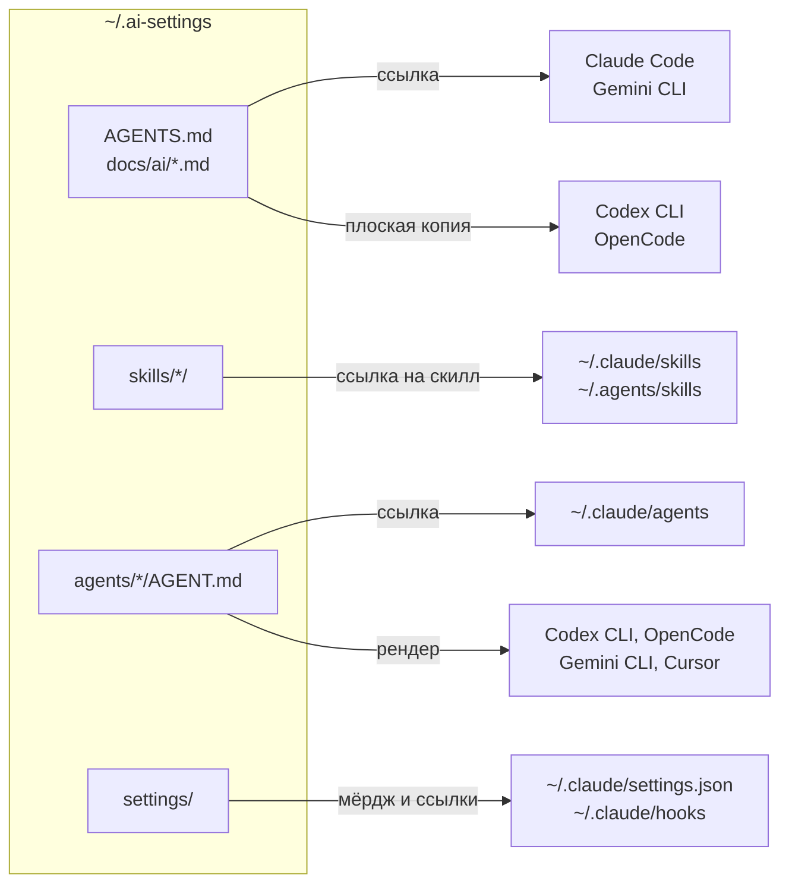

# Архитектура

Карта репы: что где лежит и как попадает в харнессы. Почему раскладка именно такая, написано в [ADR 0001](docs/adr/0001-harness-agnostic-deploy.md). Как поставить и проверить конкретный харнесс — в [docs/setup/](docs/setup/).

## Коротко

Репа — единственный источник моих правил, скиллов и агентов. `scripts/install.sh` раскладывает их по хоумам харнессов. Правлю я только в репе: ссылки видят правку сразу, сгенерированные файлы — после следующего `install.sh`.



## Поддержка

Поддерживаю я два харнесса: **Claude Code** и **OpenCode**. Ими я пользуюсь каждый день, раскладку в них проверял вживую, и поломку в них я чиню.

Codex CLI, Gemini CLI, Cursor и Claude Desktop установщик тоже обслуживает, но я ими не пользуюсь и не поддерживаю. Вживую я их не проверял: работает ли раскладка там вообще, не знаю. Код и гайды для них остаются как задел для того, кто возьмётся их поддерживать. Начинать стоит с раздела «Известные ограничения» ниже.

## Принципы

- **Репа не линкуется каталогом.** В `~/.claude/{skills,agents,hooks}` и `~/.agents/skills` лежат поштучные ссылки, остальным харнессам достаются сгенерированные файлы. Целиком линкуются только файлы инструкций: их `@imports` резолвятся от реального пути. Поэтому в репу не попадает чужое — ни `npx skills`, ни синк аккаунтных скиллов Claude Code.
- **Один источник на артефакт.** Правила — `AGENTS.md` и `docs/ai/`, скилл — `skills/<name>/`, агент — `agents/<name>/AGENT.md`. Формат конкретного харнесса получается рендером, руками я его не пишу.
- **Установщик трогает только своё.** Своё — это ссылки в репу и файлы с меткой `managed-by: ai-settings`. Чужие файлы и ссылки остаются на месте. Файл, который стоит там, где должна быть ссылка, уезжает в `backups/<ts>/`, а не удаляется.
- **Пользовательские конфиги не мои.** `opencode.jsonc`, `~/.codex/config.toml` и настройки Gemini установщик не пишет. `~/.claude/settings.json` он мёрджит по правилам ниже.
- **Повторный прогон ничего не меняет.** `install.sh --dry-run` печатает план и ничего не трогает.
- **Bootstrap на системном Python.** `sync.py` запускает системный `python3`, на чистом маке это 3.9. Поэтому только stdlib и без `match/case`.

## Карта репы

```
ai-settings/
├── AGENTS.md                  # глобальные правила, импортируют docs/ai/
├── CLAUDE.md, GEMINI.md       # обёртки из одной строки @./AGENTS.md
├── ARCHITECTURE.md            # этот файл
├── docs/
│   ├── ai/                    # модули правил: персона, стиль, стандарты, git, гейты
│   ├── setup/                 # гайды по харнессам, кастомизации и новому проекту
│   ├── adr/                   # архитектурные решения
│   ├── agents/                # настройка matt-скиллов для этой репы
│   └── links.md               # ссылки по AI-кодингу
├── skills/<name>/             # свои скиллы: SKILL.md, README.md, CHANGELOG.md
├── agents/<name>/AGENT.md     # субагенты в формате Claude Code
├── settings/                  # шаблон ~/.claude/settings.json и скрипты хуков
├── scripts/
│   ├── install.sh             # точка входа: sync.py all и RTK
│   ├── sync.py                # раскладка по харнессам, за ним пакет aisettings/
│   ├── init-project.sh        # проектный слой: AGENTS.md, CHANGELOG.md, TODO.md
│   ├── deploy-skills.sh       # скиллы в Claude Desktop
│   ├── new.py                 # заготовка нового скилла или агента
│   └── bump-skill-version.sh  # версия скилла и заготовка записи в его CHANGELOG
└── tests/                     # pytest: установщик, skill-lint, agent-lint
```

## Артефакты

### Правила

`AGENTS.md` собирает глобальные правила из модулей `docs/ai/*.md` через `@imports`. `CLAUDE.md` и `GEMINI.md` — обёртки из одной строки `@./AGENTS.md`.

Claude Code и Gemini CLI разворачивают `@imports` сами, поэтому получают ссылки: `~/.claude/CLAUDE.md`, `~/.gemini/GEMINI.md` и `~/.gemini/AGENTS.md`. Вторая ссылка у Gemini нужна, потому что импорт из `GEMINI.md` он резолвит от каталога ссылки.

Codex, OpenCode и Cursor импорты не разворачивают. Для них `sync.py rules` пишет плоскую копию, в которой все модули уже внутри: `~/.codex/AGENTS.md`, `~/.config/opencode/AGENTS.md` и `~/.cursor/rules/ai-settings.mdc`. Копию обновляет только `install.sh` или `sync.py rules`, править её руками бесполезно.

### Скиллы

Деплоятся только скиллы, которые отслеживает git: `skills/<name>/SKILL.md`. На каждый `sync.py skills` ставит две ссылки под тем же именем: `~/.claude/skills/<name>` для Claude Code и `~/.agents/skills/<name>` для остальных харнессов. Ссылку в репу на скилл, которого больше нет, он удаляет, остальное в этих каталогах не трогает.

Настоящий каталог в `skills/` с `SKILL.md`, который git не отслеживает и не игнорирует, скорее всего забытый `git add`. `sync.py` на каждом прогоне предупреждает о нём и называет команду. Симлинки (`npx skills`), `synced/` и `.trash/` под предупреждение не попадают. Новый скилл заводит `scripts/new.py skill <name>`: три файла по заготовке, имя проверяется по regex Agent Skills, существующий каталог не перезаписывается.

Внешние скиллы ставит `npx skills`: канонично в `~/.agents/skills`, плюс ссылки в `~/.claude/skills`. Репа ими не владеет, установщик их не трогает. Команды — в [README](README.md#внешние-скиллы).

Claude Desktop — отдельный канал, эти каталоги он не читает. Скиллы туда возит `deploy-skills.sh`, см. [гайд](docs/setup/claude-desktop.md).

### Агенты

Источник — `agents/<name>/AGENT.md` в формате Claude Code: frontmatter с `name`, `description`, `tools` и `model`, тело — промпт. Claude Code получает ссылку `~/.claude/agents/<name>.md`, остальные харнессы — рендер в свой формат:

| Харнесс | Файл | Что делает рендер |
|---|---|---|
| OpenCode | `~/.config/opencode/agents/<name>.md` | `mode: subagent`; `permission` из `tools`: без Edit и Write — `edit: deny`, без Bash — `bash: deny` |
| Codex CLI | `~/.codex/agents/<name>.toml` | промпт в `developer_instructions`; без Edit и Write — `sandbox_mode = "read-only"` |
| Gemini CLI | `~/.gemini/agents/<name>.md` | `tools` в именах Gemini: Read → `read_file` и `read_many_files`, Edit → `replace` и так далее |
| Cursor | `~/.cursor/agents/<name>.md` | `model: inherit`; без Edit и Write — `readonly: true` |

Модель я задаю только в Claude Code. В остальных харнессах субагент работает на модели агента, который его вызвал.

Агенты деплоятся по тому же правилу, что и скиллы: только отслеживаемые git, про неотслеживаемый каталог с `AGENT.md` `sync.py` предупреждает. Имя берётся из каталога, а Claude Code показывает `name` из frontmatter, поэтому при расхождении `sync.py` падает и называет файл. Заготовку делает `scripts/new.py agent <name>`, проверяет агентов agent-lint в `tests/agent_lint/`.

Рендер помечен `# managed-by: ai-settings`. Помеченный файл установщик перезаписывает, а рендер агента, которого в репе больше нет, удаляет. Файл без метки под именем агента репы уезжает в `backups/<ts>/`, под другим именем остаётся на месте.

### Настройки Claude Code

`sync.py claude` мёрджит шаблон `settings/claude-settings.json` в `~/.claude/settings.json`. Шаблон владеет `$schema`, списками `permissions.allow`, `permissions.ask` и `permissions.deny` и своими хуками. Остальные ключи и чужие хуки, например agterm, остаются как были. Если файл не читается как JSON, установщик ничего не меняет и падает. Правила мёрджа целиком — в [гайде Claude Code](docs/setup/claude-code.md#settingsjson).

Скрипты хуков линкуются поштучно: `~/.claude/hooks/<script>` → `settings/hooks/<script>`.

### RTK

`install.sh` ставит бинарник `rtk`, если его нет. Claude Code получает PreToolUse-хук `rtk hook claude` из шаблона настроек, OpenCode — плагин `~/.config/opencode/plugins/rtk.ts` через `rtk init -g --opencode --hook-only --no-patch`.

## Матрица харнессов

| Харнесс | Поддержка | Правила | Скиллы | Агенты | Читает в проекте |
|---|---|---|---|---|---|
| Claude Code | да, 2.1.289 | ссылка `~/.claude/CLAUDE.md` | `~/.claude/skills` | ссылка `~/.claude/agents/<name>.md` | `AGENTS.md`, `CLAUDE.md` |
| OpenCode | да, 1.18.34 | плоский `~/.config/opencode/AGENTS.md` | `~/.agents/skills`, `~/.claude/skills` | `~/.config/opencode/agents/<name>.md` | `AGENTS.md` |
| Codex CLI | нет | плоский `~/.codex/AGENTS.md` | `~/.agents/skills` | `~/.codex/agents/<name>.toml` | `AGENTS.md` |
| Gemini CLI | нет | ссылки `~/.gemini/{GEMINI,AGENTS}.md` | `~/.agents/skills` | `~/.gemini/agents/<name>.md` | `GEMINI.md` |
| Cursor | нет | только UI, см. ограничения | `~/.agents/skills`, `~/.claude/skills` | `~/.cursor/agents/<name>.md` | `AGENTS.md`, `.cursor/rules/` |
| Claude Desktop | нет | — | `deploy-skills.sh` | — | — |

В колонке поддержки — версия, на которой я проверял раскладку вживую. Остальные строки собраны по документации харнессов.

## Проектный слой

Глобальные правила уже работают в любом проекте. `scripts/init-project.sh` добавляет только то, что принадлежит самому проекту: `AGENTS.md` под факты проекта, `CHANGELOG.md` и `TODO.md`, которых требуют мои правила. С `--cursor` он кладёт копию глобальных правил в `.cursor/rules/ai-settings.mdc` и прячет её от git через `.git/info/exclude`. Подробно — в [гайде по новому проекту](docs/setup/new-project.md).

## Код установщика

`install.sh` — тонкая обёртка: проверка на Windows, `sync.py all` и RTK. Раскладку целиком делает `scripts/sync.py` с подкомандами `all`, `rules`, `skills`, `agents` и `claude`. За ним пакет `scripts/aisettings/`, по модулю на тип артефакта: `rules.py`, `skills.py`, `agents.py`, `claude.py`. Общий для скиллов и агентов список отслеживаемых каталогов — в `tracked.py`. Каждое изменение в хоуме идёт через `Fs` из `fs.py`. На нём держатся `--dry-run`, бэкапы и гард, который не даёт писать в каталог, на деле лежащий внутри репы. Устройство модулей описано в [scripts/aisettings/README.md](scripts/aisettings/README.md).

Проверки:

```bash
.venv/bin/python -m pytest -q        # установщик, skill-lint, agent-lint
.venv/bin/ruff check .
.venv/bin/ruff format --check .
.venv/bin/mypy                                    # tests/, Python 3.14
.venv/bin/mypy --python-version 3.10 scripts      # клиентская зона, ниже mypy не целится
```

Те же проверки перед каждым коммитом гоняет pre-commit. Хук ставлю один раз в клоне: `uv sync --frozen && .venv/bin/pre-commit install`. Пути в хуках относительные (`.venv/bin/...`), поэтому в worktree, созданном руками, нужен свой `.venv` или симлинк на основной: `ln -s <основной клон>/.venv .venv`. Без этого коммит падает на `Executable .venv/bin/ruff not found`, а обходить его через `--no-verify` нельзя.

## Известные ограничения

Всё, что касается Codex, Gemini и Cursor, — заметки для будущего мейнтейнера, сам я это чинить не планирую.

- Пользовательские правила Cursor берёт только из своего UI. Файл `~/.cursor/rules/ai-settings.mdc` он, судя по [документации](https://cursor.com/docs/rules), не читает. Мои правила попадают в Cursor через проект: `init-project.sh --cursor`. Это расходится с матрицей в ADR 0001.
- OpenCode читает скиллы и из `~/.agents/skills`, и из `~/.claude/skills`. Дубли он схлопывает по имени и на каждый пишет предупреждение в лог. Как с этим справляется Cursor, я не проверял.
- OpenCode обходит `~/.claude/skills` рекурсивно и подбирает `synced/` и `.trash/` синка Claude Code.
- Gemini CLI не видит проектный `AGENTS.md`, пока его нет в `context.fileName`.
- Скрипты рассчитаны на macOS и Linux, на Windows — только через WSL.
